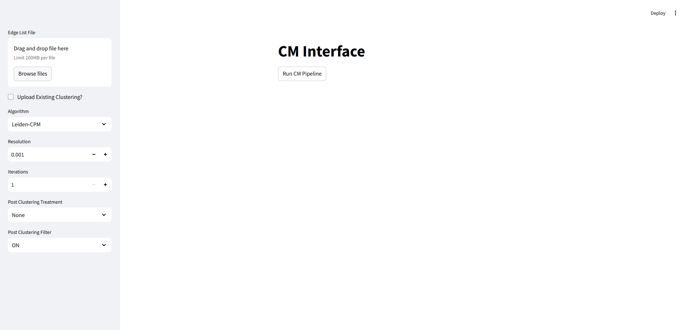
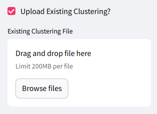

# Introduction -
Community detection (clustering) in networks has broad applications [@Fortunato2022]. Evaluation of clusters generated by methods for community detection is a non-trivial task that can be approached from diferent perspectives reflecting contextual objectives. Beyond the intuitive expectation that clusters would be edge-dense compared to the network background, an important, but sometimes overlooked, quality of "good clusters" is that they should be well-connected [@park2023wellconnectedcommunitiesrealworldsynthetic;@traag2019louvain]. Here we describe a user-friendly GUI that enables clustering of a network and modification of the clustering to meet specified criteria for well-connectedness. Three options are offered. The Connectivity Modifier (CM) method [@Ramavarapu2024], Connected Components (CC) and Well-Connected Clusters (WCC) [@park2024improved]. The GUI makes the generation of well-connected clusters accessible to non-expert users who must otherwise negotiate the sometimes complicated procedures for installation and use clustering software via command line operations.

# The CM Pipeline - 

CM was developed to enforce well-connectedness in clusters generated during a community detection process [@park2023wellconnectedcommunitiesrealworldsynthetic;@Ramavarapu2024]. Well-connectedness of a cluster is defined by its min-cut, the minimum number of edges that need to be removed in order for the cluster to be split. In the CM Pipeline, if the min-cut of a cluster is above a user-specified threshold, a cluster is considered well-connected. If not, then the min-cut is applied and the products of the cut (two clusters) are re-clustered and re-tested for their min-cuts until every community is well-connected. The threshold specified in the CM paper is the mild standard of $log_{10}n$, with $n$ being the number of nodes in the community but the pipeline allows users to specify their own criteria through custom functions.

# The WCC Pipeline - 

WCC is a simple modification of CM that omits the reclustering step.  Thus, clusters are repeatedly split into two clusters until each cluster satisfies the required connectivity bound. [@park2024improved]

# Statement of need -

Clustering has broad applications. A user-friendly GUI can lower the barrier for entry and allows simple exploratory analysis. This GUI is also intended to be useful as an instructional tool. 

# The GUI - 

The GUI consists of a front-end and a back-end to enable remote hosting of the GUI on a website. Both are implementing in Python. The front-end is in Streamlit [@streamlit], and the back-end in FastAPI [@ramirez_fastapi_2018].

At present, the GUI has support for 4 different clustering algorithms \autoref{fig:Algorithms}: Leiden-CPM (Constant Potts Model) [@traag2019louvain;@traag2011narrow] \autoref{fig:Leiden-CPM}, Leiden-Modularity [@traag2019louvain], Infomap [@Rosvall2008] and Stochastic Block Models (SBM) [@peixoto_graph-tool_2014]. 

Each algorithm takes a set of parameters that must be specified before running the pipeline. These vary from algorithm to algorithm, with some having more options than others. The parameters are explained in the CM Pipeline documentation and in the CM-GUI documentation.

The network edge list should be uploaded by the user. They also have the option of uploading an additional file with an existing clustering, this skips the initial clustering stage of the CM Pipeline. 

The results can be downloaded at the end of the run by clicking the "Download Clustering data as CSV" button.

# Running the GUI

To run the CM Pipeline GUI the user has two options: a Docker installation and a manual install. 

The Docker version is the preferred method of running the GUI. This was seen as a way of simplifying the install for the user, since some of the packages necessary for running the CM Pipeline require specific machine conditions and specific operating systems. The Dockerfile and docker-compose files automate the process of installing every required package inside a virtual machine, making it accessible to more users.

There is also the option of installing every required package locally. The user then must run the back-end and front-end in separate terminals. 

In both cases, the user can access the GUI via the front-end URL.

# Conclusions

# Future Installments

Next steps include replacing the current WCC and CC options for the same post treatment in the CM++ version.

# Acknowledgements
Work on this project was supported by funds from the Illinois-Insper Partnership.

# References
<!-- 
1. Ramavarapu et al., (2024). CM++ - A Meta-method for Well-Connected Community Detection. Journal of Open Source Software, 9(93), 6073, https://doi.org/10.21105/joss.06073

2. Park, M. et al. (2024). Identifying Well-Connected Communities in Real-World and Synthetic Networks. In: Cherifi, H., Rocha, L.M., Cherifi, C., Donduran, M. (eds) Complex Networks & Their Applications XII. COMPLEX NETWORKS 2023. Studies in Computational Intelligence, vol 1142. Springer, Cham. https://doi.org/10.1007/978-3-031-53499-7_1

3. Park, Minhyuk, Daniel Wang Feng, Siya Digra, The-Anh Vu-Le, George Chacko, and Tandy Warnow. "Improved Community Detection using Stochastic Block Models." In International Conference on Complex Networks and Their Applications, pp. 103-114. Cham: Springer Nature Switzerland, 2024. https://link.springer.com/chapter/10.1007/978-3-031-82435-7_9

4. Traag, V. A., Waltman, L., & Van Eck, N. J. (2019). From Louvain to Leiden: guaranteeing well-connected communities. Scientific reports, 9(1), 1-12.

5. Traag, V. A., Van Dooren, P., & Nesterov, Y. (2011). Narrow scope for resolution-limit-free community detection. Physical Review E—Statistical, Nonlinear, and Soft Matter Physics, 84(1), 016114.

6. Rosvall, M., & Bergstrom, C. T. (2008). Maps of random walks on complex networks reveal community structure. Proceedings of the national academy of sciences, 105(4), 1118-1123.

7. Peixoto, T., “The graph-tool python library”, figshare. (2014) DOI: 10.6084/m9.figshare.1164194

8. Fortunato, S., Newman, M.E.J. 20 years of network community detection. Nat. Phys. 18, 848–850 (2022). https://doi.org/10.1038/s41567-022-01716-7

9. Ramírez, S. (2018). FastAPI. Retrieved from https://fastapi.tiangolo.com/

10. Streamlit Inc. (2019). Streamlit. Retrieved from https://streamlit.io/ -->
