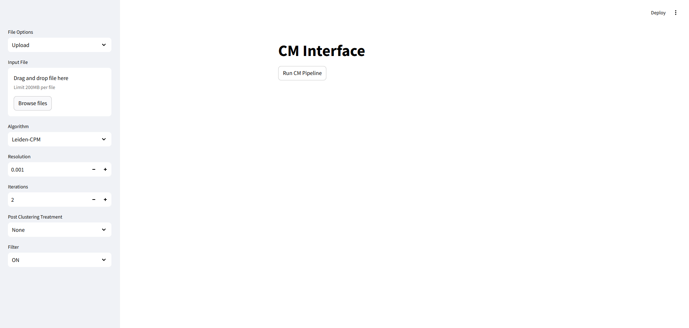
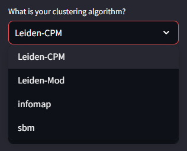
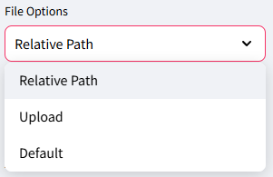

# Introduction -
Clustering networks is a common step in many applications, but clusters may not satisfy desired degrees of "well-connectedness". Here we describe a GUI that allows the user to take a clustering of a network and modify the clusters so that they meet the desired well-connectedness bound.  The techniques that are enabled include the Connectivity Modifier (CM) method [@Ramavarapu2024] and the simpler variant, Well-Connected Clusters (WCC). The purpose of this GUI is to make these tools accessible to non-expert users who are not comfortable with command line operations.

# The CM Pipeline - 

CM was developed to enforce well-connectedness in clusters generated during a community detection process [@park2023wellconnectedcommunitiesrealworldsynthetic] and implemented as a pipeline. Well-connectedness of a cluster is defined by its min-cut, the minimum number of edges (connections between nodes) that need to be discarded in order for the cluster to be split. If the min-cut is above a user-specified threshold, a cluster is considered well-connected. If not, then the min-cut is applied and the products of the cut (two clusters) are re-evaluated until every community is well-connected. The default threshold is the mild standard of $log_{10}n$, with $n$ being the number of nodes in the community. 

# The WCC Pipeline - 

WCC is a simple modification of CM that omits the reclustering step.  Thus, clusters are repeatedly split into two clusters until each cluster satisfies the required connectivity bound. (CITE)

# Statement of need -

Clustering has broad applications. In some cases, its practitioners may not have adequate programming skills to use available clustering software. A user-friendly GUI lowers the barrier for entry and allow simple exploratory analysis. This GUI is also intended to be useful as an instructional tool for novice users. 

# The GUI - 

The GUI consists of a front-end and a back-end. This was set up this way to enable remotedly hosting the GUI, making it a website. This is also why there is an option to download the end file. This, however, does not mean the GUI is currently hosted on any machine. 

The front-end is implemented in streamlit, and the back-end in FastAPI. Those packages where chosen because of their ease of use and modularity.

It has support for 4 different clustering algorithms \autoref{fig:Algorithms}: Leiden-CPM (Constant Potts Model) [@traag2019louvain; @traag2011narrow] \autoref{fig:Leiden-CPM}, Leiden-Modularity [@traag2019louvain], Infomap [@Rosvall2008] and Stochastic Block Models (SBM) [@peixoto_graph-tool_2014]. These algorithms will not be explained in this paper. 

Each one has their own set of parameters that must be specified before running the pipeline. They vary from algorithm to algorithm, with some having more options than others. 

Each algorithm's parameters are explained in the CM Pipeline documentation and in the CM-GUI documentation.

Files can be either uploaded or have their relative file path given \autoref{fig:File-Settings}. 

Additionally, the software has it's own toy network for users to experient on, that is the "Default" option in the selection box.

The results can be downloaded at the end of the run by clicking the "Download data as CSV" button. A statistical analysis is also provided and can be downloaded using the "Download stats as CSV".

# Running the GUI Locally

To run the GUI, the user must clone the repository and run both the front-end and the back-end locally, each in their own terminal. Specified instructions and setup are explained in detail in the documentation for the GUI.

After the setup is done, the user can run the CM Pipeline through the front-end.

# Running the Containerized GUI

There is also an option of running a containerized version of the GUI in Docker. The instructions are presented in the README of the repo and the code is in a branch called "Docker". The Dockerfile and docker-compose files are already present and automate the process of running both back and front-end in one singular container, that has two images that share the same filespace. 

The GUI's front-end can be accessed through the same port and URL as running it locally.

# Future Installments

Next steps include uploading an existing clustering to the GUI and using it in the CM Pipeline, as well as replacing the current WCC and CC options for the same post treatment in the CM++ version.

# References

1. Ramavarapu et al., (2024). CM++ - A Meta-method for Well-Connected Community Detection. Journal of Open Source Software, 9(93), 6073, https://doi.org/10.21105/joss.06073

2. Park, M. et al. (2024). Identifying Well-Connected Communities in Real-World and Synthetic Networks. In: Cherifi, H., Rocha, L.M., Cherifi, C., Donduran, M. (eds) Complex Networks & Their Applications XII. COMPLEX NETWORKS 2023. Studies in Computational Intelligence, vol 1142. Springer, Cham. https://doi.org/10.1007/978-3-031-53499-7_1

3. Traag, V. A., Waltman, L., & Van Eck, N. J. (2019). From Louvain to Leiden: guaranteeing well-connected communities. Scientific reports, 9(1), 1-12.

4. Traag, V. A., Van Dooren, P., & Nesterov, Y. (2011). Narrow scope for resolution-limit-free community detection. Physical Review E—Statistical, Nonlinear, and Soft Matter Physics, 84(1), 016114.

5. Rosvall, M., & Bergstrom, C. T. (2008). Maps of random walks on complex networks reveal community structure. Proceedings of the national academy of sciences, 105(4), 1118-1123.

6. Peixoto, T., “The graph-tool python library”, figshare. (2014) DOI: 10.6084/m9.figshare.1164194
